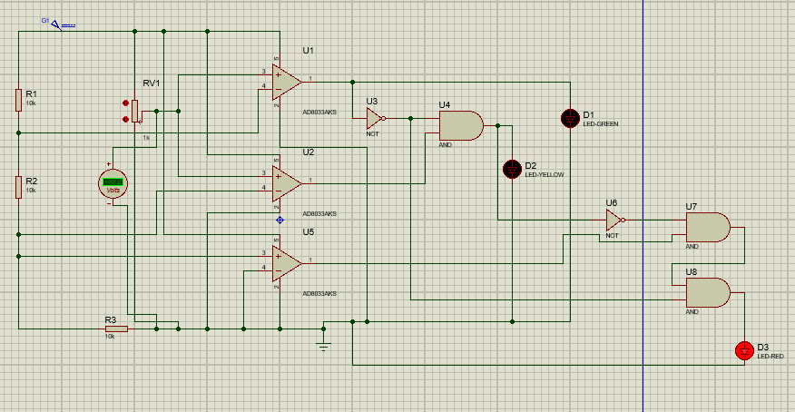

# Conception d'un détecteur de tension à logique discrète

- Conception et réalisation d'un système de détection de tension sans microcontrôleur
- Implémentation de comparateurs à amplificateurs opérationnels pour la détection de seuils 
- Utilisation de portes logiques (NAND) et de diodes pour la gestion des états 
- Création d'un affichage visuel à LEDs multicolores indiquant 3 niveaux de tension 
        