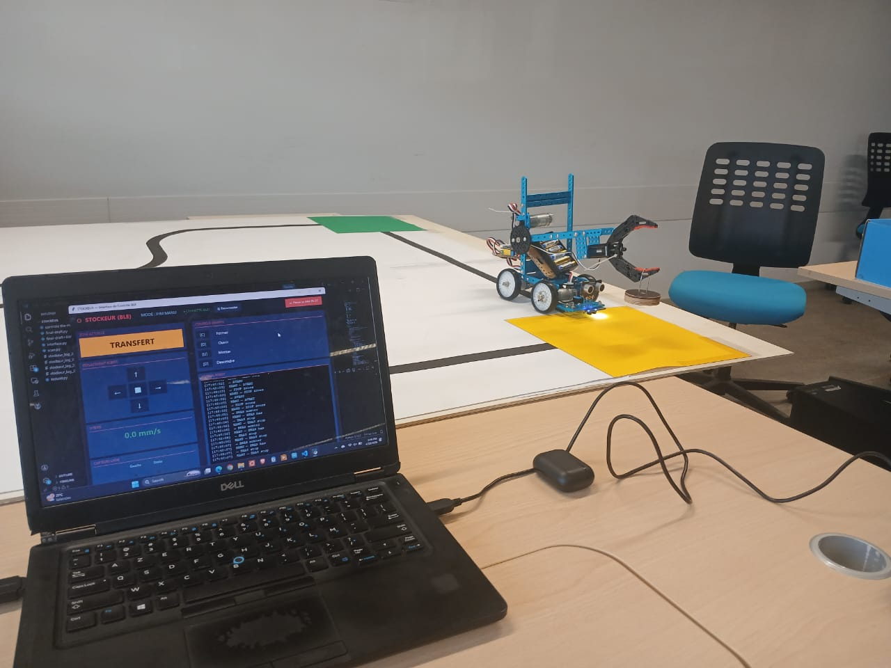
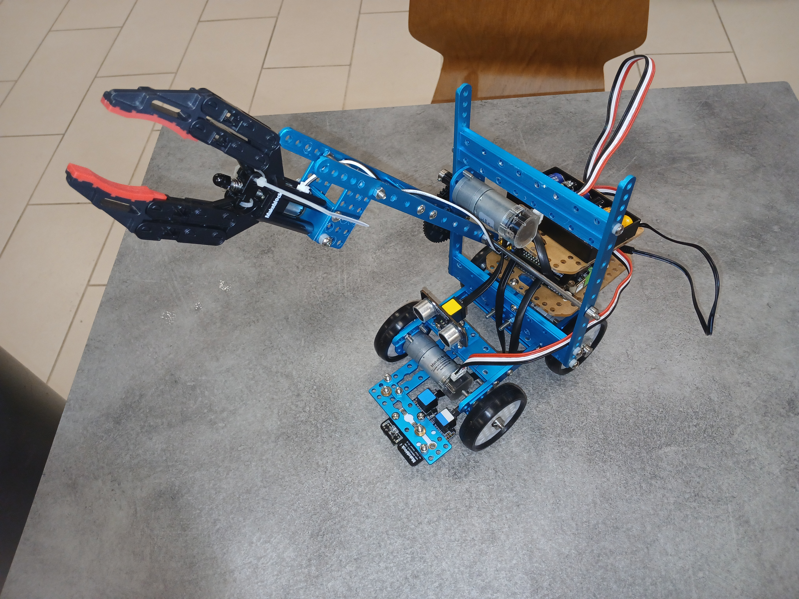

# STOCKEUR — Robot Téléopéré BLE pour Transport de Déchets

> Projet d'évaluation PRISM M1 — IMT Mines Alès 2025  
> Inspiré du concours ROBAFIS™ - AFIS 2018

Robot mobile autonome/téléopéré chargé de transporter un conteneur de déchets à travers un centre de retraitement simulé, avec IHM de supervision PC via Bluetooth.

---

## Aperçu



[](https://www.youtube.com/watch?v=GE7u1V_TMe0)

**Contexte opérationnel :** simulation d'un centre de retraitement de déchets nucléaires à échelle réduite (3000 × 1500 mm). Le robot doit transporter un conteneur de la zone de transfert jusqu'à la zone d'enfouissement, en traversant une zone de confinement, dans un temps inférieur à 480 secondes.
---

## Fonctionnalités

- **Mode PILOT (automatique)** — suivi de ligne noire au sol par capteur optique, arrêt automatique sur obstacle (sonar), détection de zones colorées, limitation de vitesse à 80 mm/s
- **Mode MANU (téléopéré)** — contrôle clavier temps-réel depuis l'IHM PC : déplacements, bras et pince du préhenseur
- **Sécurité active** — ralentissement automatique à 15 mm/s en zone d'enfouissement (zone noire), arrêt d'urgence sur perte de connexion BLE, alertes visuelles de dépassement de vitesse
- **Communication BLE** — protocole custom bidirectionnel sur Serial3, streaming de données à 5 Hz
- **IHM de supervision** — interface Python/Tkinter avec visualisation de la vitesse, position, zone courante, état des capteurs, journal d'événements

---

## Architecture du système

```
┌─────────────────────────────────────────┐
│           PC — IHM Python               │
│  ┌──────────────┐  ┌──────────────────┐ │
│  │  IHM PILOT   │  │   IHM MANU       │ │
│  │  (auto)      │  │   (clavier)      │ │
│  └──────┬───────┘  └────────┬─────────┘ │
│         └──────────┬────────┘           │
│              Thread série               │
│           (pyserial + BLE)              │
└──────────────────┬──────────────────────┘
                   │ BLE Serial (115200 baud)
                   │ Protocole : DATA: / LOG: / CMD
┌──────────────────┴──────────────────────┐
│         MegaPi — Firmware C++           │
│  ┌──────────┐  ┌──────────┐             │
│  │ Encodeurs│  │  Sonar   │             │
│  │ (ISR)    │  │  (100ms) │             │
│  └──────────┘  └──────────┘             │
│  ┌──────────┐  ┌──────────┐             │
│  │ Capteur  │  │ Capteur  │             │
│  │ ligne    │  │ couleur  │             │
│  └──────────┘  └──────────┘             │
│  ┌──────────┐  ┌──────────┐             │
│  │ Moteurs  │  │ Bras +   │             │
│  │ (x2)     │  │ Pince    │             │
│  └──────────┘  └──────────┘             │
└─────────────────────────────────────────┘
```

---

## Protocole de communication

### Données robot → PC (streaming à 5 Hz)
```
DATA:line=0,color=RED,dist=5.2,deg1=180.0,deg2=178.5,obs=0,mode=0,spd=42.3
```

| Champ  | Description                                         |
|--------|-----------------------------------------------------|
| `line` | État capteur ligne : 0=centré, 1=gauche, 2=droite, 3=perdu |
| `color`| Zone détectée : BLACK/WHITE/RED/YELLOW/GREEN/BLUE   |
| `dist` | Distance obstacle (cm)                              |
| `deg1/2`| Rotation encodeurs (degrés)                        |
| `obs`  | Obstacle détecté (booléen)                          |
| `mode` | Mode actif : 0=PILOT, 1=MANU                        |
| `spd`  | Vitesse moyenne (mm/s)                              |

### Commandes PC → robot
| Cmd | Action              |
|-----|---------------------|
| `G` | GO (mode PILOT)     |
| `S` | STOP                |
| `F/B/L/R` | Déplacement (MANU) |
| `U/D/X` | Bras haut/bas/stop |
| `O/C/V` | Pince ouvrir/fermer/stop |
| `P/N` | Switch PILOT/MANU   |
| `W/K` | Mode lent/normal    |

---

## Matériel

| Composant              | Rôle                          |
|------------------------|-------------------------------|
| MegaPi (Arduino-compatible) | Contrôleur principal     |
| Moteurs DC × 2         | Propulsion                    |
| Moteur DC (bras)       | Préhenseur — axe vertical     |
| Moteur DC (pince)      | Préhenseur — saisie conteneur |
| MeLineFollower (PORT_6)| Suivi de ligne                |
| MeUltrasonicSensor (PORT_5) | Détection obstacle       |
| MeColorSensor (PORT_8) | Identification zones colorées |
| Encodeurs × 2 (ISR)    | Odométrie                     |
| Module BLE (Serial3)   | Communication PC ↔ Robot      |

---

## Structure du dépôt

```
14_STOCKEUR-Robot-Teleop-BLE/
├── README.md
├── firmware/
│   └── stockeur.ino          # Firmware MegaPi (C++ / Arduino)
├── interface/
│   └── Interface.py          # IHM PC (Python / Tkinter / pyserial)
├── docs/
│   ├── CDC_STOCKEUR.pdf      # Cahier des charges complet
│   ├── robot_photo.jpg       # Photo du robot assemblé
│   └── demo.mp4              # Vidéo de démonstration
└── requirements.txt
```

---

## Lancer l'interface

```bash
pip install pyserial
```

Modifier le port dans `Interface.py` :
```python
SERIAL_PORT = "COM13"   # Windows
# SERIAL_PORT = "/dev/ttyUSB0"  # Linux
```

```bash
python Interface.py
```

> Le module BLE doit être appairé et connecté avant le lancement.

---

## Séquences de mission

La mission se décompose en 6 séquences successives selon le cahier des charges :

| Séq. | Mode   | Description                                      | Vmax     |
|------|--------|--------------------------------------------------|----------|
| 1    | PILOT  | Maintenance → Zone de transfert (ligne noire)    | 80 mm/s  |
| 2    | MANU   | Prise en charge du conteneur                     | —        |
| 3    | PILOT  | Zone de transfert → Zone de confinement          | 80 mm/s  |
| 4    | MANU   | Dépôt du conteneur en zone d'enfouissement       | 15 mm/s  |
| 5    | MANU   | Décontamination + sortie zone de confinement     | 15 mm/s  |
| 6    | PILOT  | Retour à l'aire de stockage                      | 80 mm/s  |

---

## Points techniques notables

- **Encodeurs en interruption** (`attachInterrupt` sur INT 18/19) pour odométrie précise sans polling
- **Architecture non bloquante** côté Python : thread dédié à la lecture série, UI rafraîchie à 10 Hz
- **Logique de confinement stateful** : toggle à chaque franchissement de marquage rouge, commutation de mode vitesse automatique
- **Auto-switch IHM** : basculement automatique PILOT → MANU à la détection d'une zone colorée (RED/GREEN/YELLOW)
- **Arrêt de sécurité** : `send_cmd("S")` automatique sur perte de connexion BLE

---

## Auteur

Mohamed Salem Mohamed Ahmed — IMT Mines Alès  
[github.com/RCHADE](https://github.com/RCHADE)